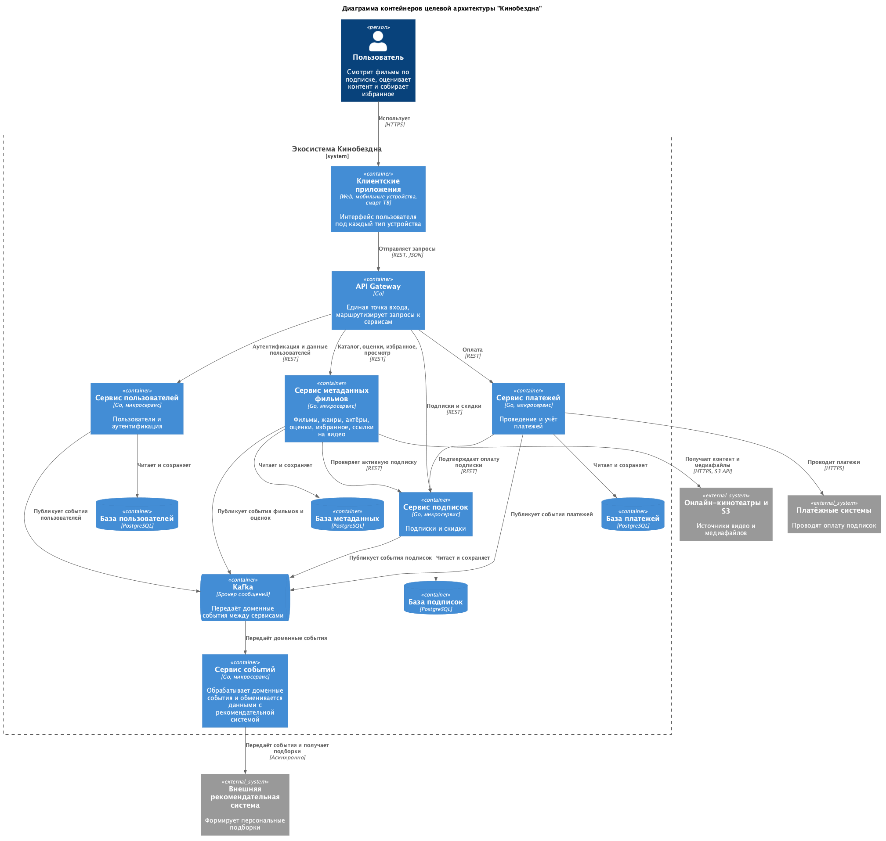
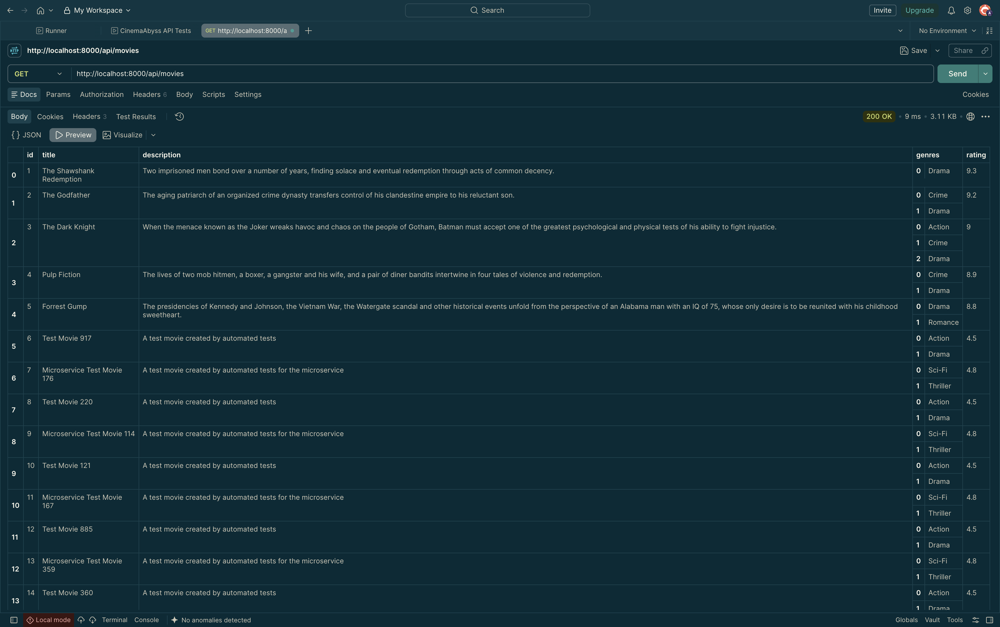
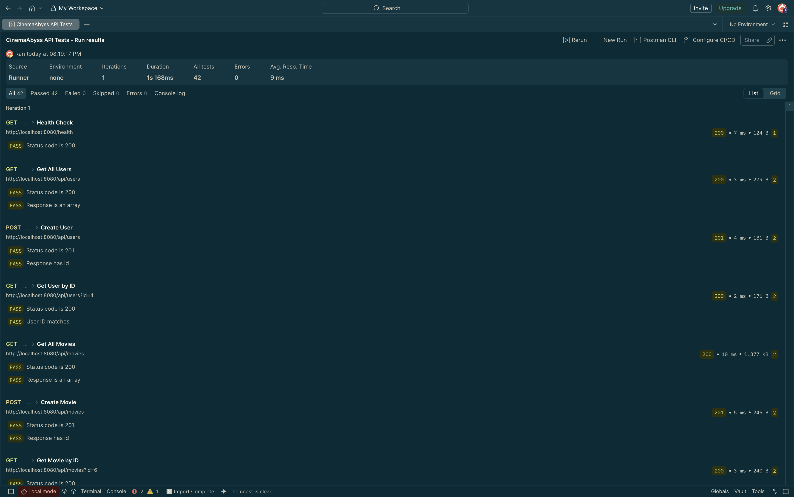
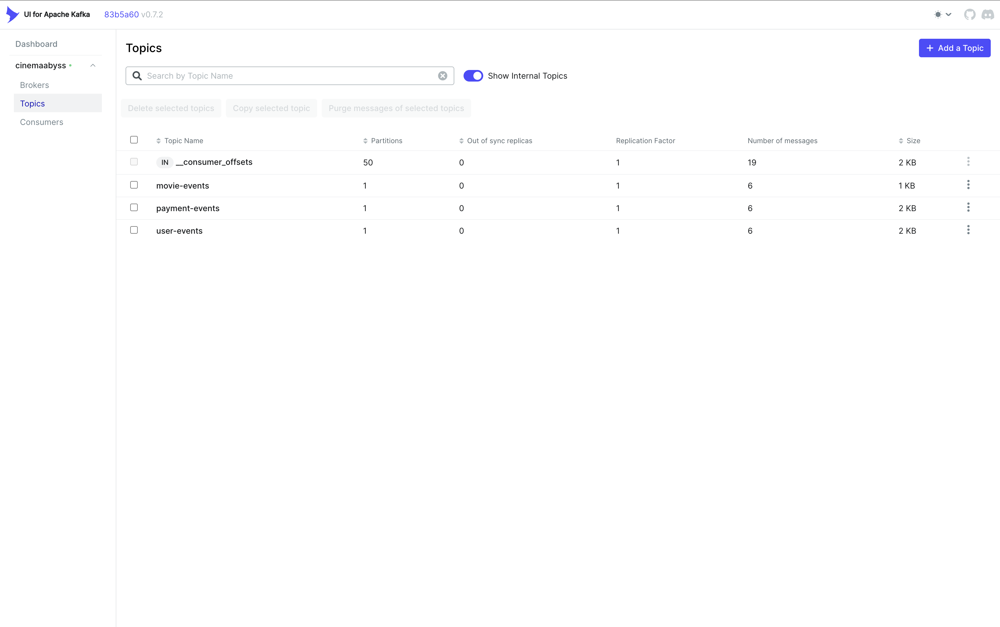
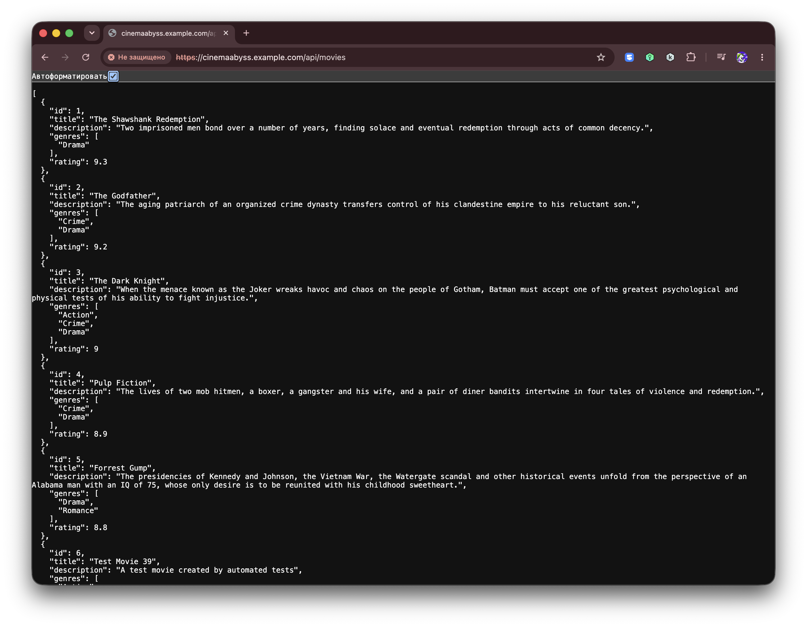

## Задание 1. Проектирование архитектуры

**Диаграмма контейнеров C4 целевой (To-Be) архитектуры**


[Исходный код диаграммы](schemas/target-system-containers.puml)


## Задание 2. Proxy и Kafka

**Запрос к API Gateway: GET /api/movies**



**Результаты Postman-тестов**



**Состояние топиков Kafka**




## Задание 3

**Вызов https://cinemaabyss.example.com/api/movies**



**Логи events-service после тестов**

```bash
kubectl -n cinemaabyss logs -l app=events-service
```

```text
{"time":"2026-09-28T20:26:52.805152471Z","level":"WARN","msg":"kafka connect attempt failed","service":"events","client":"producer","attempt":3,"max_attempts":30,"error":"kafka: client has run out of available brokers to talk to: dial tcp 10.96.134.30:9092: connect: connection refused"}
{"time":"2026-09-28T20:26:56.571603667Z","level":"WARN","msg":"kafka connect attempt failed","service":"events","client":"producer","attempt":4,"max_attempts":30,"error":"kafka: client has run out of available brokers to talk to: dial tcp 10.96.134.30:9092: connect: connection refused"}
{"time":"2026-09-28T20:27:00.600244293Z","level":"INFO","msg":"consumer started","service":"events","group":"events-service","topics":["movie-events","user-events","payment-events"]}
{"time":"2026-09-28T20:27:00.60295746Z","level":"INFO","msg":"events service listening","service":"events","address":":8082"}
{"time":"2026-09-28T20:39:12.981844633Z","level":"INFO","msg":"event published","service":"events","event_id":"movie-6-viewed","event_type":"movie","topic":"movie-events","partition":0,"offset":0}
{"time":"2026-09-28T20:39:12.990400674Z","level":"INFO","msg":"event consumed","service":"events","topic":"movie-events","partition":0,"offset":0,"event_id":"movie-6-viewed","event_type":"movie","payload":{"action":"viewed","movie_id":6,"title":"Test Movie Event","user_id":4}}
{"time":"2026-09-28T20:39:13.107879216Z","level":"INFO","msg":"event published","service":"events","event_id":"user-4-logged_in","event_type":"user","topic":"user-events","partition":0,"offset":0}
{"time":"2026-09-28T20:39:13.110806091Z","level":"INFO","msg":"event consumed","service":"events","topic":"user-events","partition":0,"offset":0,"event_id":"user-4-logged_in","event_type":"user","payload":{"action":"logged_in","timestamp":"2026-09-28T20:39:13.098Z","user_id":4,"username":"testuser"}}
{"time":"2026-09-28T20:39:13.231337174Z","level":"INFO","msg":"event published","service":"events","event_id":"payment-4-completed","event_type":"payment","topic":"payment-events","partition":0,"offset":0}
{"time":"2026-09-28T20:39:13.234836341Z","level":"INFO","msg":"event consumed","service":"events","topic":"payment-events","partition":0,"offset":0,"event_id":"payment-4-completed","event_type":"payment","payload":{"amount":9.99,"method_type":"credit_card","payment_id":4,"status":"completed","timestamp":"2026-09-28T20:39:13.222Z","user_id":4}}
```

## Задание 4
Для простоты дальнейшего обновления и развертывания вам как архитектуру необходимо так же реализовать helm-чарты для прокси-сервиса и проверить работу 

Для этого:
1. Перейдите в директорию helm и отредактируйте файл values.yaml

```yaml
# Proxy service configuration
proxyService:
  enabled: true
  image:
    repository: ghcr.io/db-exp/cinemaabysstest/proxy-service
    tag: latest
    pullPolicy: Always
  replicas: 1
  resources:
    limits:
      cpu: 300m
      memory: 256Mi
    requests:
      cpu: 100m
      memory: 128Mi
  service:
    port: 80
    targetPort: 8000
    type: ClusterIP
```

- Вместо ghcr.io/db-exp/cinemaabysstest/proxy-service напишите свой путь до образа для всех сервисов
- для imagePullSecret проставьте свое значение (скопируйте из конфигурации kubernetes)
  ```yaml
  imagePullSecrets:
      dockerconfigjson: ewoJImF1dGhzIjogewoJCSJnaGNyLmlvIjogewoJCQkiYXV0aCI6ICJaR0l0Wlhod09tZG9jRjl2UTJocVZIa3dhMWhKVDIxWmFVZHJOV2hRUW10aFVXbFZSbTVaTjJRMFNYUjRZMWM9IgoJCX0KCX0sCgkiY3JlZHNTdG9yZSI6ICJkZXNrdG9wIiwKCSJjdXJyZW50Q29udGV4dCI6ICJkZXNrdG9wLWxpbnV4IiwKCSJwbHVnaW5zIjogewoJCSIteC1jbGktaGludHMiOiB7CgkJCSJlbmFibGVkIjogInRydWUiCgkJfQoJfSwKCSJmZWF0dXJlcyI6IHsKCQkiaG9va3MiOiAidHJ1ZSIKCX0KfQ==
  ```

2. В папке ./templates/services заполните шаблоны для proxy-service.yaml и events-service.yaml (опирайтесь на свою kubernetes конфигурацию - смысл helm'а сделать шаблоны для быстрого обновления и установки)

```yaml
template:
    metadata:
      labels:
        app: proxy-service
    spec:
      containers:
       Тут ваша конфигурация
```

3. Проверьте установку
Сначала удалим установку руками

```bash
kubectl delete all --all -n cinemaabyss
kubectl delete  namespace cinemaabyss
```
Запустите 
```bash
helm install cinemaabyss .\src\kubernetes\helm --namespace cinemaabyss --create-namespace
```
Если в процессе будет ошибка
```code
[2025-04-08 21:43:38,780] ERROR Fatal error during KafkaServer startup. Prepare to shutdown (kafka.server.KafkaServer)
kafka.common.InconsistentClusterIdException: The Cluster ID OkOjGPrdRimp8nkFohYkCw doesn't match stored clusterId Some(sbkcoiSiQV2h_mQpwy05zQ) in meta.properties. The broker is trying to join the wrong cluster. Configured zookeeper.connect may be wrong.
```

Проверьте развертывание:
```bash
kubectl get pods -n cinemaabyss
minikube tunnel
```

Потом вызовите 
https://cinemaabyss.example.com/api/movies
и приложите скриншот развертывания helm и вывода https://cinemaabyss.example.com/api/movies


# Задание 5
Компания планирует активно развиваться и для повышения надежности, безопасности, реализации сетевых паттернов типа Circuit Breaker и канареечного деплоя вам как архитектору необходимо развернуть istio и настроить circuit breaker для monolith и movies сервисов.

```bash

helm repo add istio https://istio-release.storage.googleapis.com/charts
helm repo update

helm install istio-base istio/base -n istio-system --set defaultRevision=default --create-namespace
helm install istio-ingressgateway istio/gateway -n istio-system
helm install istiod istio/istiod -n istio-system --wait

helm install cinemaabyss .\src\kubernetes\helm --namespace cinemaabyss --create-namespace

kubectl label namespace cinemaabyss istio-injection=enabled --overwrite

kubectl get namespace -L istio-injection

kubectl apply -f .\src\kubernetes\circuit-breaker-config.yaml -n cinemaabyss

```

Тестирование

# fortio
```bash
kubectl apply -f https://raw.githubusercontent.com/istio/istio/release-1.25/samples/httpbin/sample-client/fortio-deploy.yaml -n cinemaabyss
```

# Get the fortio pod name
```bash
FORTIO_POD=$(kubectl get pod -n cinemaabyss | grep fortio | awk '{print $1}')

kubectl exec -n cinemaabyss $FORTIO_POD -c fortio -- fortio load -c 50 -qps 0 -n 500 -loglevel Warning http://movies-service:8081/api/movies
```
Например,

```bash
kubectl exec -n cinemaabyss fortio-deploy-b6757cbbb-7c9qg  -c fortio -- fortio load -c 50 -qps 0 -n 500 -loglevel Warning http://movies-service:8081/api/movies
```

Вывод будет типа такого

```bash
IP addresses distribution:
10.106.113.46:8081: 421
Code 200 : 79 (15.8 %)
Code 500 : 22 (4.4 %)
Code 503 : 399 (79.8 %)
```
Можно еще проверить статистику

```bash
kubectl exec -n cinemaabyss fortio-deploy-b6757cbbb-7c9qg -c istio-proxy -- pilot-agent request GET stats | grep movies-service | grep pending
```

И там смотрим 

```bash
cluster.outbound|8081||movies-service.cinemaabyss.svc.cluster.local;.upstream_rq_pending_total: 311 - столько раз срабатывал circuit breaker
You can see 21 for the upstream_rq_pending_overflow value which means 21 calls so far have been flagged for circuit breaking.
```

Приложите скриншот работы circuit breaker'а

Удаляем все
```bash
istioctl uninstall --purge
kubectl delete namespace istio-system
kubectl delete all --all -n cinemaabyss
kubectl delete namespace cinemaabyss
```
